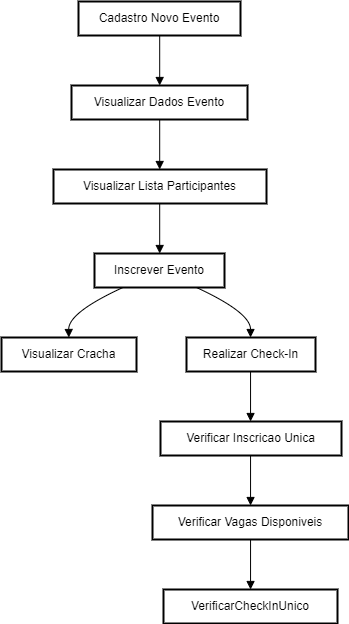

<div align="center">
  <h1>pass.in API</h1>
  <p>O pass.in API é uma aplicação de gestão de participantes em eventos presenciais. A ferramenta permite que o organizador cadastre um evento e abra uma página pública de inscrição. Os participantes inscritos podem emitir uma credencial para check-in no dia do evento. O sistema fará um scan da credencial do participante para permitir a entrada.</p>
   
</div>

# 📒 Índice
* [Descrição](#descrição)
* [Requisitos Funcionais](#requisitos)
* [Tecnologias](#tecnologias)
* [Endpoints](#endpoints)
* [Instalação](#instalação)
* [Licença](#licença)

# 📃 <span id="descrição">Descrição</span>
O pass.in API é uma aplicação de gestão de participantes em eventos presenciais. A ferramenta permite que o organizador cadastre um evento e abra uma página pública de inscrição. Os participantes inscritos podem emitir uma credencial para check-in no dia do evento. O sistema fará um scan da credencial do participante para permitir a entrada no evento. Desenvolvida utilizando superset [**TypeScript**](https://www.typescriptlang.org/), com a biblioteca [**Fastify**](https://www.fastify.io/) para web server, [**Prisma ORM**](https://www.prisma.io/) para manipulação de dados do banco [**SQLite**](https://www.sqlite.org/), [**Zod**](https://github.com/colinhacks/zod) sendo utilizado para as validações de requisitos e resposta, sendo documentado por [**Swagger**](https://swagger.io/).

# 📌 <span id="requisitos">Requisitos Funcionais</span>
- [x] O organizador deve poder cadastrar um novo evento<br>
- [x] O organizador deve poder visualizar dados de um evento<br>
- [x] O organizador deve poser visualizar a lista de participantes<br>
- [x] O participante deve poder se inscrever em um evento<br>
- [x] O participante deve poder visualizar seu crachá de inscrição<br>
- [x] O participante deve poder realizar check-in no evento<br>
- [x] O participante só pode se inscrever em um evento uma única vez<br>
- [x] O participante só pode se inscrever em eventos com vagas disponíveis<br>
- [x] O participante só pode realizar check-in em um evento uma única vez<br>

# 💻 <span id="tecnologias">Tecnologias</span>
- **JavaScript**
- **TypeScript**
- **Fastify**
- **Zod**
- **Prisma ORM**
- **SQLite**
- **Swagger**
- **tsup**

# 📍 <span id="endpoints">Endpoints</span>
| Método | Endpoint               | Resumo
|--------|----------------------|-----------------------------------------------------
<kbd>POST</kbd> | <kbd>/events</kbd> | Responsável por criar o evento
<kbd>GET</kbd> | <kbd>/events/:eventId</kbd> | Responsável por exibir um evento especifico, informando eventId por *query param*
<kbd>GET</kbd> | <kbd>/events/:eventId/attendees</kbd> | Responsável por listar os participantes de um evento especifico, informando o ID do evento por *query param*
<kbd>POST</kbd> | <kbd>/events/:eventId/attendees</kbd> | Responsável por inscrever um participante em um evento especifico, informando o ID do evento por *query param*
<kbd>GET</kbd> | <kbd>/attendee/:attendeeId/check-in</kbd> | Responsável por realizar check-in de um participante em um evento especifico, informando o ID do participante por *query param*
<kbd>GET</kbd> | <kbd>/attendees/:attendeeId/badge</kbd> | Responsável por permitir visualizar crachá de inscrição de um participante, informando o ID do participante por *query param*
<kbd>GET</kbd> | <kbd>/docs</kbd> | Responsável por servir a documentação dos recursos da API

# 🚀 <span id="instalação">Instalação</span>
```bash
  # Clone este repositório:
  $ git clone https://github.com/CleilsonAndrade/pass.in-api.git
  $ cd ./pass.in-api

  # Instalar as dependências:
  $ yarn install

  # Gerar o código TypeScript com base nos modelos do Prisma:
  $ npx prisma generate

  # Aplicar migrações ao banco de dados:
  $ yarn db:migrate

  # Executar:
  $ yarn dev

  # Realizar build:
  $ yarn build
```

# 📝 <span id="licença">Licença</span>
Esse projeto está sob a licença MIT. Veja o arquivo [LICENSE](LICENSE) para mais detalhes.

---

<p align="center">
  Feito com 💜 by CleilsonAndrade
</p>